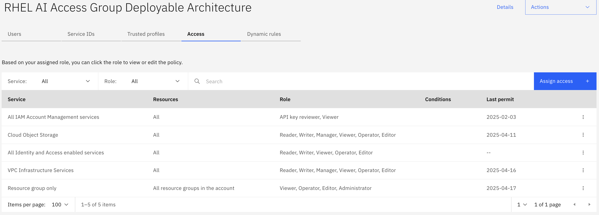
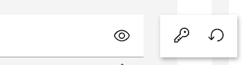
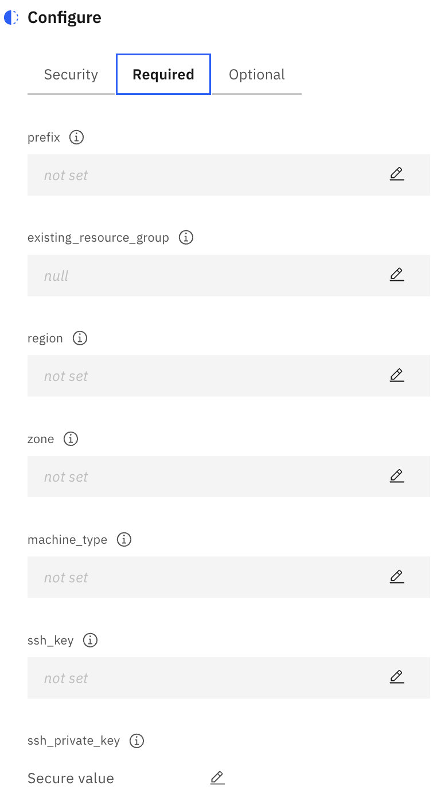
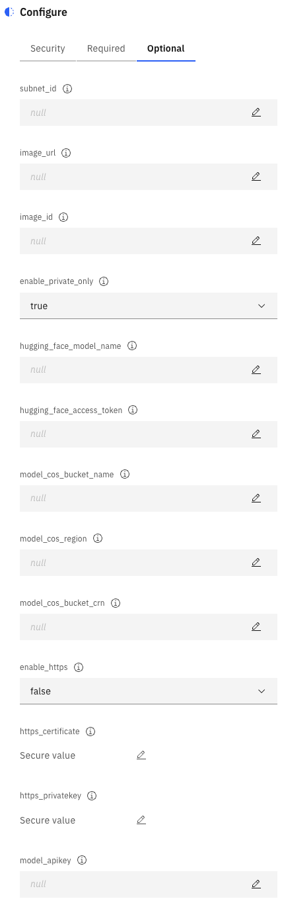

## Overview

The architecture provides a RHEL AI instance on IBM Cloud and serves a fine-tuned model as a service with a public end point or a private endpoint. The RHEL AI instance serves a vLLM model using instruct lab.

This documentation has the following sections that describe the architecture and the deployment of RHEL AI on IBM Cloud to inference the model of your choice.

- [Objective](#objective)
- [Reference Architecture](#reference-architecture)
- [Planning](#planning)
    - [ ] [Confirm IBM Cloud Settings](#confirm-your-ibm-cloud-settings)
    - [ ] [Set the IAM permissions](#set-the-iam-permissions)
    - [ ] [Access for IBM Cloud projects](#access-for-ibm-cloud-projects)
- [Deploying RHEL AI on IBM Cloud with a model](#deploying-rhel-ai-on-ibm-cloud-with-a-model)
    - [ ] [STEP-1: Create RHEL AI Project from IBM Cloud Catalog](#step-1-create-rhel-ai-project-from-ibm-cloud-catalog)
    - [ ] [STEP-2: Configure RHEL AI Project](#step-2-configure-the-rhel-ai-project)
    - [ ] [STEP-3: Validate and Deploy](#step-3-validate-and-deploy)
- [Terraform Requirements](#requirements)

### Objective
The objective is to provide a "Quick Start" solution  for users to be able to deploy the RHEL AI instance and validate, test the fine-tuned models on IBM Cloud. The architecture is intended for

- Accelerating the validation and testing of fine tuned models on IBM Cloud RHEL AI instance
- Enable users to bring in their fine tuned model solutions in a secure environment and create demos
- Provide inferencing of the fine tuned models through vLLM API interface

## Reference Architecture

The architecture diagram describes the resources deployed to run models downloaded from Hugging Face or model files available in IBM Cloud Object Storage. The architecture can be a public network connectivity or a private only.

**Steps that show case the deployment automation**

1. Provision a VSI instance in a VPC using RHEL AI image and NVIDIA accelerated GPU compute
2. Download the model from Hugging Face or from COS bucket and serve the model using Instruct lab
3. Optionally enable secure SSL connection if required to inference the model. You have the option to restrict the network connectivity to private only and block all the traffic coming from public network

### Solution Components

| Category | Solution components | How it is used in the solution |
| -------- | ------------------- | ------------------------------ |
| Compute  | NVIDIA GPUs         | The deployable architecture provides only two compute profiles, a gx3-24x120x1l40s with single l40 GPU or gx3-48x240x2l40s with 2 GPUs. Depending on the size of the model select the compute profile |
|          | RHEL AI Image       | A RHEL AI image with version 1.4 and above |
| Storage  | Boot Volume         | A 250 GB boot volume storage to run the model |
|          | Cloud Object Storage | Model files downloaded from IBM Cloud Object storage. This is not provisioned by Deployable Architecture but required when downloading models from IBM COS bucket |
| Networking | Virtual Private Clouds (VPCs), Subnets, Security Groups (SGs) | VPCs for RHEL AI instance isolation Subnets, SGs for restricted access to model service |
|            | Public Gateway  | Egress traffic to allow RHEL AI instance to access Hugging Face registry |
|            | Floating IP     | Access to inference models on port 8000 for http and 8443 for https |
|            | SSL Connection  | Enable Https using a proxy service |
| Security   | Access management | IBM Cloud Identity & Access Management |

### Solution Requirements

The following table represents a typical set of requirements for RHEL AI deployment on IBM Cloud

| Aspect | Requirements |
| ------ | ------------ |
| Compute | Select one of the two NVIDIA GPU accelerated computes, a l40 GPU or  2l40 GPUs |
| Networking | Deploy workloads in an secure environment with Security Groups in place |
| Security | Help ensure that all operation actions run securely. |

## Planning

Before you begin the deployment of RHEL AI instance on IBM Cloud, make sure that you understand and meet the prerequisites.

### Confirm your IBM Cloud settings

Complete the following steps before you deploy the RHEL AI deployable architecture.

#### Confirm or set up an IBM Cloud account:

Make sure that you have an IBM Cloud Pay-As-You-Go or Subscription account:

- If you don't have an IBM Cloud account, [create one](https://cloud.ibm.com/docs/account?topic=account-account-getting-started).
- If you have a Trial or Lite account, [upgrade your account](https://cloud.ibm.com/docs/account?topic=account-upgrading-account).

### Set the IAM permissions

1. Set up account access (Cloud Identity and Access Management (IAM)):

    a. Create an IBM Cloud [API key](https://cloud.ibm.com/docs/account?topic=account-userapikey&interface=ui#create_user_key). The user who owns this key must have the Administrator role.

    b. [Set up access groups](https://cloud.ibm.com/docs/account?topic=account-account-getting-started#account-gs-accessgroups).

    User access to IBM Cloud resources is controlled by using the access policies that are assigned to access groups.

    When you assign access to the group

    - Select All Identity and Access enabled services .

    - Select Resource Group

    - Select VPC Infrastructure Services

    - Select Cloud Object Storage

2. Verify access roles

    IAM access roles are required to install this deployable architecture and create all the required elements.

    You need the following permissions for this deployable architecture:

    - Access to view API Keys in All Identity and Access enabled services

    - Create resource group or access existing resource group

    - Create and modify IBM Cloud VPC services, virtual server instances, networks, network prefixes, storage volumes, SSH keys, and security groups of this VPC.

    - Access existing Object Storage services.

Your Access Group should look like this

### Access for IBM Cloud projects

You can use IBM Cloud projects as a deployment option. Projects are designed with infrastructure as code and compliance in mind to help ensure that your projects are managed, secure, and always compliant. For more information, see [Learn about IaC deployments with projects](https://cloud.ibm.com/docs/secure-enterprise?topic=secure-enterprise-understanding-projects).

You need the following access to create a project and create project tooling resources within the account. Make sure you have the following access:

- The Editor role on the Projects service.
- The Editor and Manager role on the Schematics service
- The Viewer role on the resource group for the project

For more information, see [Assigning users access to projects](https://cloud.ibm.com/docs/secure-enterprise?topic=secure-enterprise-access-project).

Your User Access Policies should look like this

## Deploying RHEL AI on IBM Cloud with a model

You can deploy a deployable architecture from the IBM Cloud catalog. You can choose one of several deployment options, including with IBM Cloud projects. [Learn about IaC deployments with projects](https://cloud.ibm.com/docs/secure-enterprise?topic=secure-enterprise-understanding-projects).

To deploy a RHEL AI deployable architecture through the IBM Cloud catalog, follow these steps:

### STEP-1: Create RHEL AI Project from IBM Cloud Catalog

a. Go to the IBM Cloud [catalog](https://cloud.ibm.com/catalog#reference_architecture) and search for `RHEL AI on IBM Cloud with model inferencing`. Click the tile for details

b. Select the latest product version in Architecture section and click "Add to project". Create new project by providing Name, Configuration Name, Region and Resource Group. Click Create button after filling the required fields

### STEP-2: Configure the RHEL AI project

a. Under "Security" tab, provide the IBM Cloud API key created in the planning section under [Set the IAM permissions](#set-the-iam-permissions). If you have the API Key stored in Secrets Manager you can select the API Key from the secrets manager using the key icon 

b. Click on the "Required" fields tab and fill in the fields. Click on `i` icon for more details about the fields.

**Required Field details**

Make sure to fill in all the required field

**prefix:** A prefix makes the resource names unique while provisioning. The resources are named with {prefix}-{resource-name}.

*Example: if the prefix is `rhelai` then the resource group name will be `rhelai-rg`*

**existing_resource_group:** You can select existing resource group if you don't want to create a new resource group. If you don't have existing resource group then select `null` which is the default. The `null` option will create a new resource group with the prefix such as `{prefix}-rg`

**region:** Select a region where you want to deploy the resources. All the available regions are shown in the dropdown.

**zone:** Most of the regions have 3 zones with options zone-1, zone-2, zone-3. Select which zone you want to provision the VSI instance

**machine_type:** Select the profile of the host gpu accelerator you want to use. There are only two options available. `1 x NVIDIA L40S 48 GB` or `2 x NVIDIA L40S 48 GB`

**ssh_key:** A public SSH Key is required for preparing the RHEL AI instance with model configuration setup while initializing the RHEL AI instance.

#### ssh_private_key:
A private SSH Key is required for preparing the RHEL AI instance with model configuration setup while initializing the RHEL AI instance.
Generate public and private ssh key pair in you local machine or externally.

Your SSH key must be an RSA or ED25519 key type with a key size of either 2048 bits or 4096 bits. If your Mac system generates a key size of 3072 bits (by default), run one of the following commands to make sure that the generated key is a supported size.

For RSA SSH key type, issue:

`ssh-keygen -t rsa -b 2048 -C "user_ID"`

For ED25519 SSH key type, issue:

`ssh-keygen -t ed25519 -b 2048 -C "user_ID"`

c. Click on the Optional fields tab and fill in the necessary fields. Some fields are optional based on selection of one over the other and should have atleast one of them filled.

**Optional Field details**
Click on `i` icon for more details about the fields.

**subnet_id:** If you have an existing subnet then enter the subnet id. The DA provisions RHEL AI instance in the given subnet. This field is purely optional and has no constraints.

**image_url:** A COS url location where RHEL AI image is downloaded from Red Hat and stored in COS. A custom image is created by the DA using the COS url. The COS url should be of the format cos://{region}/{bucket}/{filename}. This is optional if you have existing custom image with image_id created. You need to fill the image_id field.

If you want to provision a RHEL AI instance with latest IBM Cloud NVIDIA based RHEL AI image from IBM Cloud COS bucket. Download [RHEL AI for NVIDIA on IBM Cloud](https://developers.redhat.com/products/rhel-ai/download) image from Red Hat.

Note: You may need to create [Red Hat account](https://sso.redhat.com/auth/realms/redhat-external/protocol/openid-connect/auth?response_type=code&client_id=rhd-dm&redirect_uri=https%3A%2F%2Fdevelopers.redhat.com%2Fcontent-gateway%2Frest%2Fkeycloak&state=edaacce8-f115-473d-b87a-ba0cec4f197f&login=true&scope=openid+rhdsupportable) to download RHEL AI image.

After you download the RHEL AI QCOW image, you need to upload in to the COS bucket. You can find the instructions to create a IBM Cloud COS instance and bucket in [Object Storage docs](https://cloud.ibm.com/docs/cloud-object-storage?topic=cloud-object-storage-secure-content-store).

*Note: Uploading the large QCOW image directly into Cloud Object Storage might take too long and also may fail. Use IBM Aspera for large file transfers to your Cloud Object Storage bucket. You can also use [minio client](https://min.io/docs/minio/linux/reference/minio-mc.html) cli tool for fast uploads to COS*

**image_id:** The VPC custom image id of RHEL AI to use while creating a GPU VSI instance. This is only optional if you are creating custom image using the image_url

You must supply either a image_id provided in cloud resources or image_url of RHEL AI image

**enable_private_only:** A flag to determine to have private IP only and no public network accessibility. The default is selected as `true` which means the VSI instance will be resticted to private only and no traffic from public internet can access. If selected as `false` you can connect to model service using http or https.

**hugginface_model_name:** Provide the model name from hugging face registry. The model will be downloaded from the Hugging Face registry. This can be optional only if you have model in COS. Use the COS configuration variables model_cos_bucket_name, model_cos_region and model_cos_bucket_crn to download the model.

**hugging_face_access_token:** The value of hugging face user access token to access the model repository from huggingface registry. If you have model in COS, then this is optional. Use the COS configuration variables model_cos_bucket_name, model_cos_region and model_cos_bucket_crn

To create a hugging face user access toke from the Hugging Face registry follow the instructions provided in [User access tokens](https://huggingface.co/docs/hub/en/security-tokens)

**model_cos_bucket_name:** Provide the COS bucket name where you model files reside. If you are using hugging_face_model_name and hugging_face_access_token then this field is optional.

**model_cos_region:** Provide COS region where the model bucket reside. If you are using hugging_face_model_name and hugging_face_access_token then this field is optional

**model_cos_bucket_crn:** Provide COS bucket instance CRN. If you are using hugging_face_model_name and hugging_face_access_token then this field is optional

**enable_https:** Enable secure SLL by hosting https service to your model service. If `true` then a proxy nginx with https certificates will be created. https_cerificate and https_privatekey are required when `true`

If you choose to enable https protocol while accessing the model service running on RHEL AI then you need to have SSL certificates. You can have self signed ssl certificates for dev but for production you need to get a signed certificate with a private key.

To create self signed certificate, follow the instructions from  [Using OpenSSL to generate and format certificates](https://www.ibm.com/docs/en/api-connect/10.0.x_cd?topic=profile-using-openssl-generate-format-certificates). Make sure to save the certificate file and private key file.

**https_certificate:** SSL certificate required for https setup. Required if enable_https is true

**https_privatekey:** SSL privatekey for https setup. Required if enable_https is true

#### model_apikey:
A model api key to setup authorization while inferencing the model. Generate your own model api key.

d. After you enter the fields, click "Save" button to save the project configurations of the Deployable Architecture

Note:
You can find the complete set of fields under [Inputs](#inputs)

### STEP-3: Validate and deploy

a. After you save the configuration, click Validate to validate the generated plan. Once the validation is successful you can review the cost breakdown of resources that gets deployed. If the validation is unsuccessful then click on the Validation Failed to see the logs. If there are any empty fields (you may need to revert them back to null) or if there are other issues in your configuration click "Edit" button to go back to configuration to edit the required and optional fields and save and validate again until its successful. If you still have issue contact the support team.

After validating and verifying the cost estimate, you can approve by providing the comments and clicking the button Approve

b. Once you are ready, you can click Deploy button to provision the resources. You can click view logs to see what resources are getting provisioned. If for some reason deployment fails you can verify the logs and report the errors to support team.

c. Once the deployment is successful, you can check the output of the deployment by clicking on "Changes deployed successfully". You see the summary of resources deployed

d. Click on View Resources button to see resources that got deployed and active

e. Change the tab to Outputs to view model details and the RHEL AI VSI details. You see a model_url in the outputs when you selected enable_private field as false (if enable_private is true then the model_url is empty in outputs). Click on the model_url to see the API documentation to inference the model

f. To undeploy the resources click on the "more options" (:) menu on the top right corner beside Edit button and you see undeploy option. Click the undeploy button to destroy all the resources including the resource group.

By following the 3 steps - Create Project, Configure RHEL AI Project, Validate and Deploy you have successfully provisioned a RHEL AI instance with a model to inference securely on IBM Cloud through automation.

<!-- BEGINNING OF PRE-COMMIT-TERRAFORM DOCS HOOK -->
### Requirements

| Name | Version |
|------|---------|
|  [terraform](#requirement\_terraform) | >= 1.9.0 |
|  [ibm](#requirement\_ibm) | >= 1.77.0, < 2.0.0 |

### Modules

| Name | Source | Version |
|------|--------|---------|
|  [https\_conf](#module\_https\_conf) | ../../modules/https_conf | n/a |
|  [model](#module\_model) | ../../modules/model | n/a |
|  [resource\_group](#module\_resource\_group) | terraform-ibm-modules/resource-group/ibm | 1.2.0 |
|  [rhelai\_instance](#module\_rhelai\_instance) | ../../modules/rhelai_instance | n/a |
|  [rhelai\_vpc](#module\_rhelai\_vpc) | ../../modules/rhelai_vpc | n/a |

### Resources

| Name | Type |
|------|------|
| [ibm_is_floating_ip.ip_address](https://registry.terraform.io/providers/IBM-Cloud/ibm/latest/docs/resources/is_floating_ip) | resource |
| [terraform_data.private_only](https://registry.terraform.io/providers/hashicorp/terraform/latest/docs/resources/data) | resource |
| [ibm_is_subnet.existing_subnet](https://registry.terraform.io/providers/IBM-Cloud/ibm/latest/docs/data-sources/is_subnet) | data source |

### Inputs

| Name | Description | Type | Default | Required |
|------|-------------|------|---------|:--------:|
|  [enable\_https](#input\_enable\_https) | Enable https to your model service? If yes then a proxy nginx with https certificates will be created. https\_cerificate and https\_privatekey are required when true | `bool` | `false` | no |
|  [enable\_private\_only](#input\_enable\_private\_only) | A flag to determine to have private IP only and no public network accessibility | `bool` | `true` | no |
|  [existing\_resource\_group](#input\_existing\_resource\_group) | Select the name of a existing resource group or select null to create new resource group. | `string` | `null` | no |
|  [https\_certificate](#input\_https\_certificate) | SSL certificate required for https setup. Required if enable\_https is true | `string` | `""` | no |
|  [https\_privatekey](#input\_https\_privatekey) | SSL privatekey for https setup. Required if enable\_https is true | `string` | `""` | no |
|  [hugging\_face\_access\_token](#input\_hugging\_face\_access\_token) | The value of hugging face user access token to access the model repository from huggingface registry. If you have model in COS, then this is optional. Use the COS configuration variables model\_cos\_bucket\_name, model\_cos\_region and model\_cos\_bucket\_crn | `string` | `null` | no |
|  [hugging\_face\_model\_name](#input\_hugging\_face\_model\_name) | Provide the model path from hugging face registry only. If you have model in COS use the COS configuration variables model\_cos\_bucket\_name, model\_cos\_region and model\_cos\_bucket\_crn | `string` | `null` | no |
|  [ibmcloud\_api\_key](#input\_ibmcloud\_api\_key) | The IBM Cloud platform API key needed to deploy IAM enabled resources. | `string` | n/a | yes |
|  [image\_id](#input\_image\_id) | The VPC custom image id of RHEL AI to use while creating a GPU VSI instance. This is optional if you are creating custom image using the image\_url | `string` | `null` | no |
|  [image\_url](#input\_image\_url) | A COS url location where RHEL AI image is downloaded from Red Hat and stored in COS. This will create custom image. The COS url should be of the format cos://{region}/{bucket}/{filename}. This is optional if you have existing custom image\_id. | `string` | `null` | no |
|  [machine\_type](#input\_machine\_type) | The machine type to be created. Please select one of the NVIDIA GPU based machine type to run the solution | `string` | n/a | yes |
|  [model\_apikey](#input\_model\_apikey) | Model API Key to setup authorization while inferencing the model | `string` | `null` | no |
|  [model\_cos\_bucket\_crn](#input\_model\_cos\_bucket\_crn) | Provide Bucket instance CRN. If you are using hugging\_face\_model\_name and hugging\_face\_access\_token then this field is optional | `string` | `null` | no |
|  [model\_cos\_bucket\_name](#input\_model\_cos\_bucket\_name) | Provide the COS bucket name where you model files reside. If you are using hugging\_face\_model\_name and hugging\_face\_access\_token then this field is optional | `string` | `null` | no |
|  [model\_cos\_region](#input\_model\_cos\_region) | Provide COS region where the model bucket reside. If you are using hugging\_face\_model\_name and hugging\_face\_access\_token then this field is optional | `string` | `null` | no |
|  [prefix](#input\_prefix) | Prefix to append to all resources created. | `string` | n/a | yes |
|  [region](#input\_region) | The region where resources are created. | `string` | n/a | yes |
|  [ssh\_key](#input\_ssh\_key) | A public ssh key is required that you have generated from. This is used for RHEL AI VSI instance | `string` | n/a | yes |
|  [ssh\_private\_key](#input\_ssh\_private\_key) | SSH Private Key that was generated to login and update model config and execute service operations. Use the private key of SSH public key provided in ssh\_key. | `string` | n/a | yes |
|  [subnet\_id](#input\_subnet\_id) | An existing subnet id where the RHEL AI instance will be deployed. This is optional and can be set to null if you want to create RHEL AI instance in a new subnet and VPC | `string` | `null` | no |
|  [zone](#input\_zone) | The zone where the RHEL AI instance needs to be deployed. | `number` | n/a | yes |

### Outputs

| Name | Description |
|------|-------------|
|  [custom\_image\_id](#output\_custom\_image\_id) | RHEL AI Custom Image ID created VPC image services |
|  [floating\_ip](#output\_floating\_ip) | The primary network attched to RHEL.ai instance |
|  [model\_url](#output\_model\_url) | The URL can be used to inference the models. For private only VSI instance you need to use the private IP |
|  [primary\_network\_interface\_id](#output\_primary\_network\_interface\_id) | The primary network attched to RHEL.ai instance |
|  [public\_gateway\_id](#output\_public\_gateway\_id) | Public gateway id attached to VPC |
|  [region](#output\_region) | The region all resources were provisioned in |
|  [resource\_group\_id](#output\_resource\_group\_id) | The ID of the resource group created or used |
|  [rhelai\_instance\_id](#output\_rhelai\_instance\_id) | The rhel.ai instance id that is provisioned. |
|  [security\_group\_id](#output\_security\_group\_id) | Security group id |
|  [subnet\_id](#output\_subnet\_id) | Subnet ID where the RHEL.ai instance is located |
|  [vpc\_id](#output\_vpc\_id) | VPC ID where the RHEL.ai instance is located |
|  [zone](#output\_zone) | The zone all resources were provisioned in |
<!-- END OF PRE-COMMIT-TERRAFORM DOCS HOOK -->
